# RentEase

**Mobile-first rental property management** for a single landlord and their tenants.

Owners manage buildings, units, leases, rent collection, expenses, and maintenance.  
Tenants see their unit, pay rent, raise issues, and message the owner — all in one Flutter app backed by a Django API.

<p align="center">
  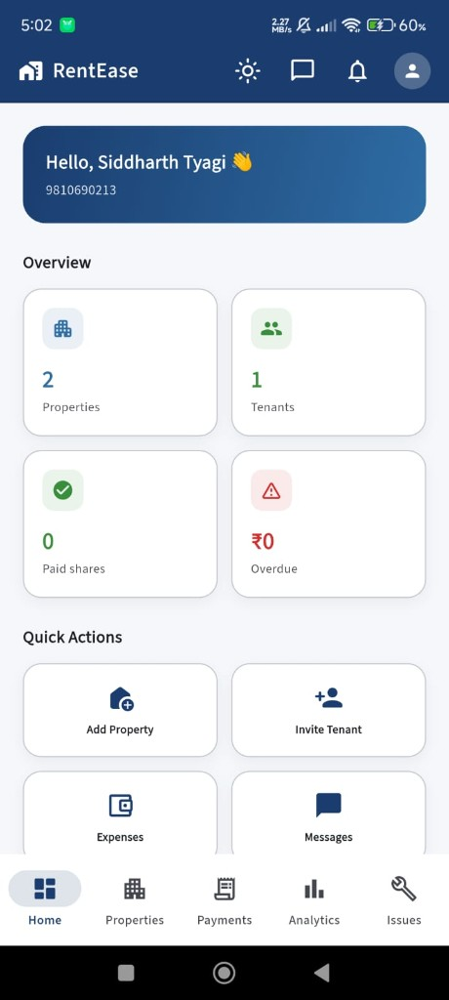
  &nbsp;
  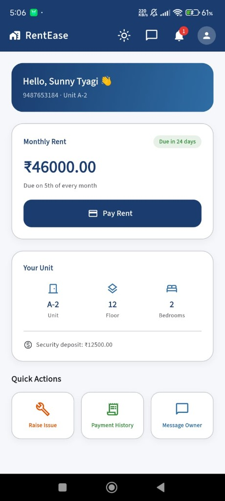
  &nbsp;
  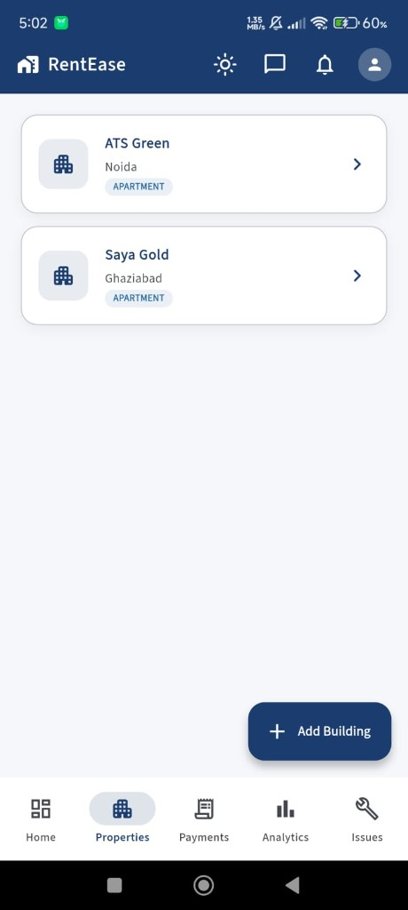
</p>

---

## Why RentEase?

Typical landlords juggle WhatsApp chats, Excel sheets, and UPI screenshots. RentEase replaces that with:

- Clear **owner dashboard** (properties, tenants, overdue rent)
- **Tenant invites** and unit-linked leases
- **Rent invoices** with online (Razorpay) or offline (UPI / bank / QR + mark paid)
- **Issues**, **chat**, **documents**, **expenses**, and **analytics** in one place
- **Light / dark** theme throughout the app

---

## Screenshots

### Owner

| Home | Properties | Payments |
|:---:|:---:|:---:|
|  |  | 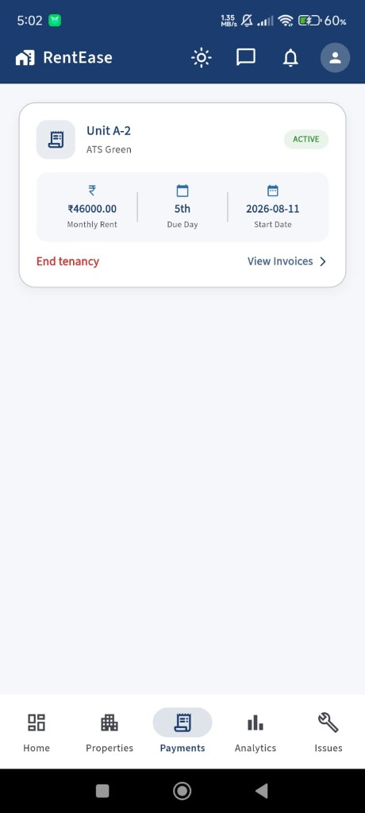 |

| Analytics | Issues | Messages |
|:---:|:---:|:---:|
| 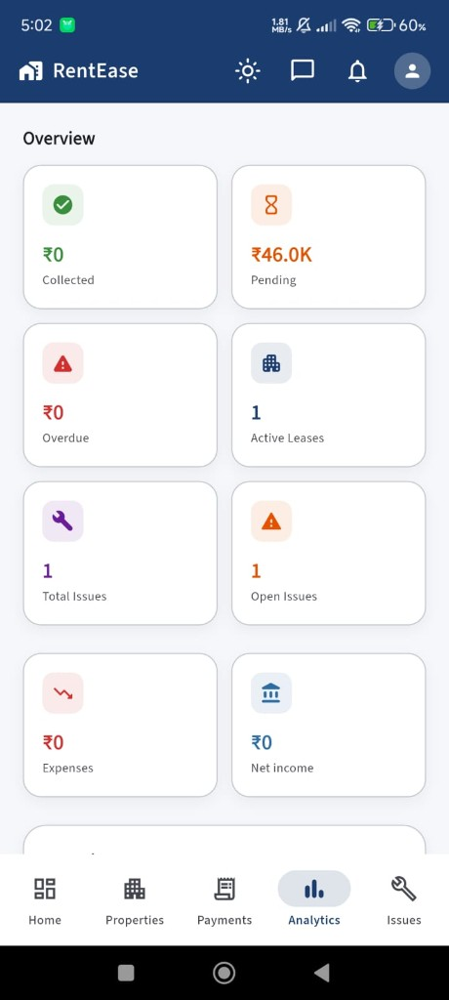 | 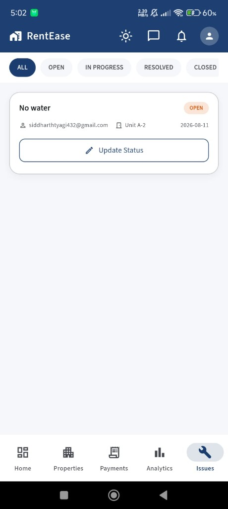 | 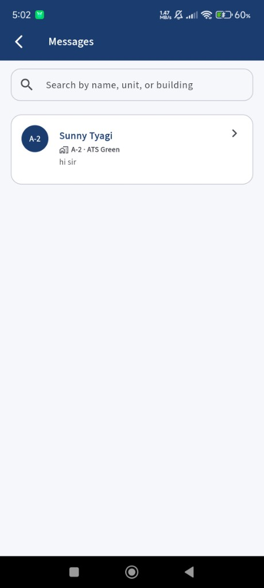 |

| Payment settings (Bank / QR) | Payment settings (Razorpay) | Analytics detail |
|:---:|:---:|:---:|
| 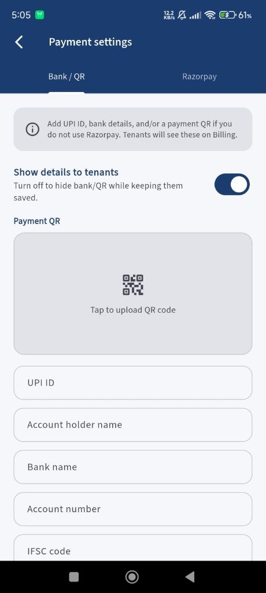 | 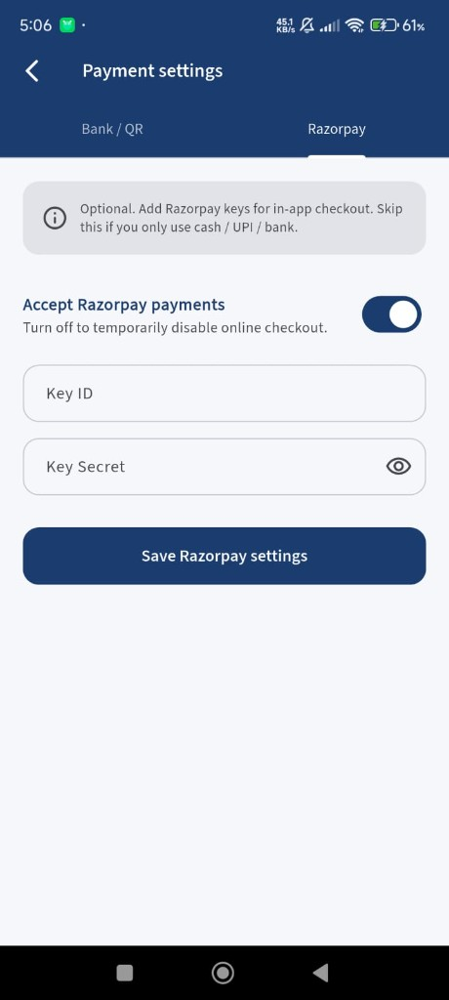 | 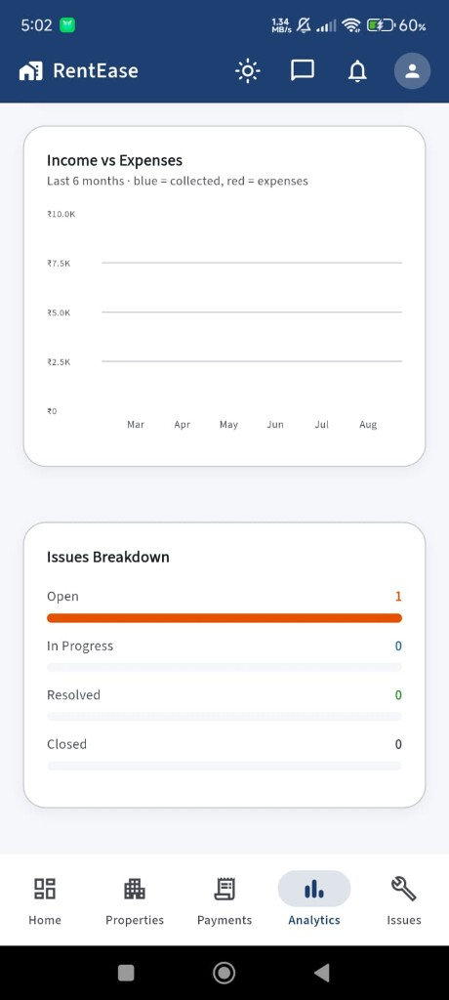 |

### Tenant

| Home | Billing | Issues |
|:---:|:---:|:---:|
|  | 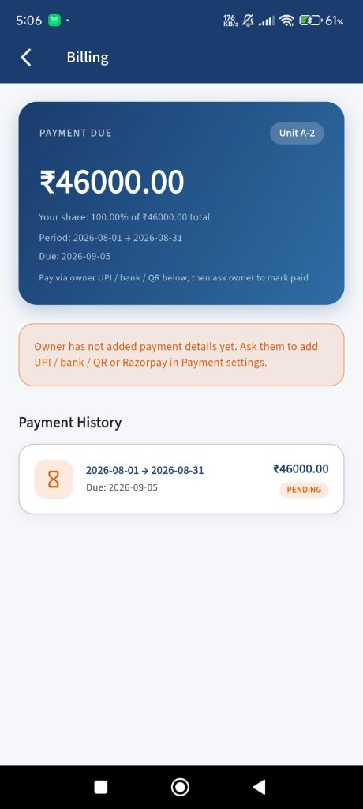 | 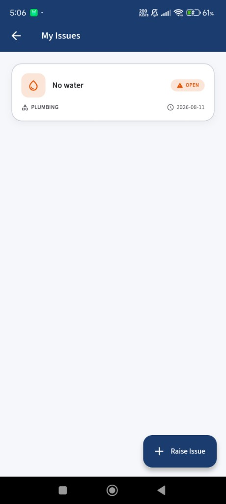 |

---

## Features

### For owners
- Register / Google sign-in as owner  
- Portfolio → buildings → units → leases  
- Invite tenants (email + deep link / Google join)  
- Generate invoices, track paid / pending / overdue shares  
- **Razorpay** checkout *or* **UPI / bank / QR** instructions  
- Mark rent paid (cash, UPI, bank transfer)  
- Expenses + income vs expenses charts  
- Issues workflow (open → in progress → resolved → closed)  
- Real-time chat (WebSocket) + FCM notifications  
- Document vault per unit  

### For tenants
- Join via invite (Google or token)  
- Home with rent due, unit details, quick actions  
- Billing history + pay online / follow owner payment details  
- Raise and track maintenance issues  
- Message owner, view documents, notifications  

### Platform
- JWT auth, strong passwords, rate limiting  
- Celery jobs for invoices & rent reminders  
- Light / dark / system theme  
- CI (Django check + Flutter analyze)  

---

## Tech stack

| Layer | Technology |
|---|---|
| Mobile | Flutter (Android / iOS), go_router, Dio, Riverpod, Firebase Messaging, Razorpay |
| API | Django 6, Django REST Framework, SimpleJWT |
| Realtime | Django Channels + Daphne (WebSockets) |
| Jobs | Celery + Redis + django-celery-beat |
| DB | PostgreSQL |
| Payments | Razorpay + manual UPI/bank/QR |
| Push / email | FCM (`firebase-admin`), SMTP |

---

## Repository layout

```text
RentEase/
├── rentease-api/          # Django REST + Channels + Celery
├── rentease_app/          # Flutter client
├── docs/screenshots/      # App screenshots
├── docker-compose.yml     # Local Postgres + Redis
├── docker-compose.prod.yml
├── PRODUCTION.md
├── RELEASE.md
└── ORACLE_DEPLOY.md       # Optional free-tier deploy notes
```

---

## Local setup

### 1. Infrastructure

```bash
docker compose up -d
```

Starts **Postgres** (`5432`) and **Redis** (`6379`).

> If Docker Desktop is not running, use a local Postgres/Redis install and match `.env`.

### 2. API

```bash
cd rentease-api
python -m venv venv
# Windows
.\venv\Scripts\activate
pip install -r requirements.txt
cp .env.example .env          # set SECRET_KEY, DB_*, GOOGLE_CLIENT_ID, etc.
python manage.py migrate
python manage.py runserver 0.0.0.0:8000
```

Optional (invoices / reminders):

```bash
celery -A config worker -l info
celery -A config beat -l info
```

Admin:

```bash
python manage.py createsuperuser
# open http://127.0.0.1:8000/admin/
```

### 3. Flutter app

```bash
cd rentease_app
flutter pub get
flutter run
```

Default API base URL is in `lib/core/app_config.dart` (LAN IP for a physical device). Override for builds:

```bash
flutter run --dart-define=API_BASE_URL=http://YOUR_LAN_IP:8000
flutter build appbundle --dart-define=API_BASE_URL=https://YOUR_API_HOST
```

---

## Typical owner → tenant flow

1. Owner registers and adds a **building** + **unit**  
2. Owner **invites** tenant Gmail to that unit  
3. Tenant opens invite / signs in with Google → lease linked  
4. System (or owner) generates a **rent invoice**  
5. Tenant pays via **Razorpay** or offline UPI/bank/QR  
6. Owner **marks paid** if cash / offline transfer  
7. Tenant raises **issues**; both chat in-app  

---

## Configuration notes

| Setting | Where |
|---|---|
| API URL | `rentease_app/lib/core/app_config.dart` or `--dart-define=API_BASE_URL=` |
| Django secrets / DB | `rentease-api/.env` (see `.env.example`) |
| Google Sign-In | `GOOGLE_CLIENT_ID` + Firebase / OAuth Android SHA |
| Razorpay | Owner **Payment settings** in-app (or env defaults) |
| FCM | `firebase-service-account.json` on API (not committed) |

---

## CI

GitHub Actions runs:

- Django `manage.py check` + migrate  
- Flutter `analyze`  

---

## License

Private / educational project unless otherwise stated by the author.

---

<p align="center">
  <b>RentEase</b> — properties, rent, and tenants in one app.
</p>
